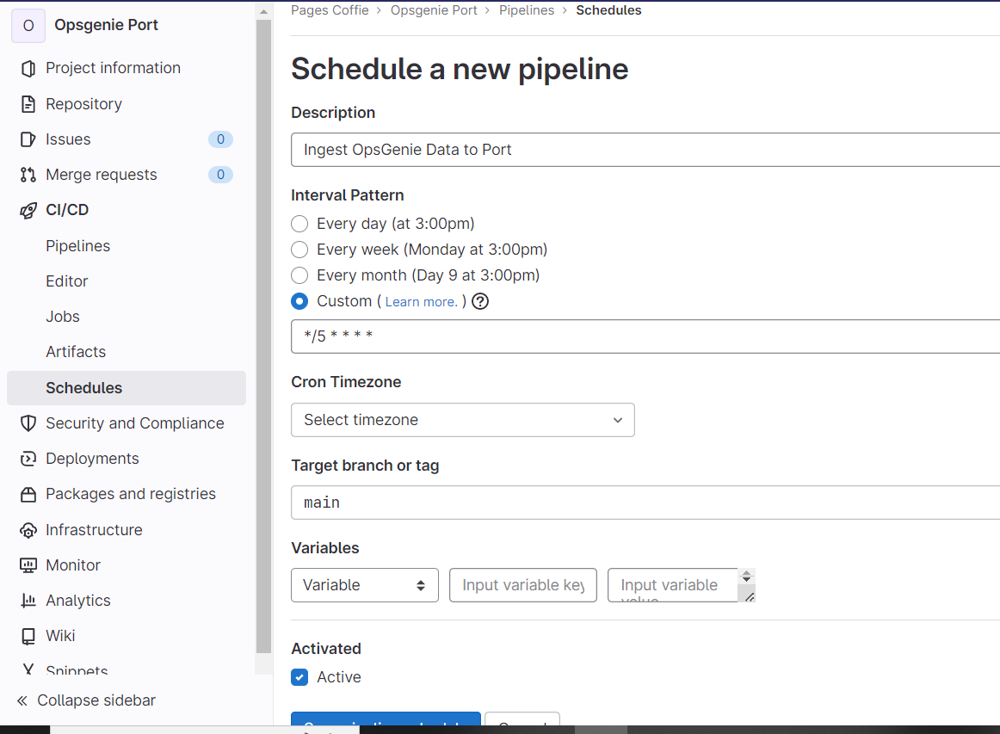
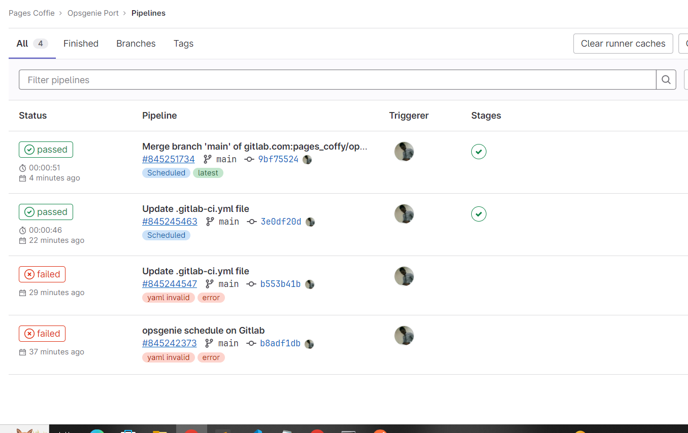

# Port Integration with OpsGenie

## Getting started

This document describes my approach to creating integrations between Port and OpsGenie's `who is on call` using REST API. 

### Oncall blueprint
Create the oncall blueprint in Port [using this json file ](./opsgenie/oncall_blueprint.md)

### Gitlab CI yaml
Place this example `.gitlab-ci.yml` file in your project's root folder

### Gitlab CI Variables
To interact with Port using Gitlab CI Pipeline, you will first need to define your Port credentials [as variables for your pipeline](https://docs.gitlab.com/ee/ci/variables/index.html#define-a-cicd-variable-in-the-ui). Then, pass the defined variables to your ci pipeline script. Ensure to add your OpsGenie API key as well to the variables.

### Schedule the script
1. Go to your Gitlab project and select CI/CD
2. Click on **Schedules** and create new schedule
3. Enter the necessary information into the form, include the Description, Interval Pattern, Timezone, Target branch and other variables specifically for the schedule.
4. Click on **Save pipeline schedule** 

#### Screenshot - Schedule

#### Screenshot - Pipeline Success

#### Screenshot - Port UI
